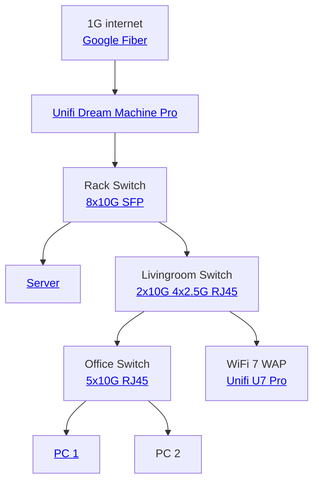

+++
title = "Network"
weight = 3
+++

 I have a 10 gigabit internal network and NVMe drives to support the speed, which gives me data transfers between my PC and server at over 1 Gigabyte per second. It's also fast for [Steam network transfers](https://help.steampowered.com/en/faqs/view/46BD-6BA8-B012-CE43), but they use some compression or internal cap that prevents it from maxing out the network speed. Real world transfer is around 2-3 gigabit.

This tool supports diagrams, how neat is that?

